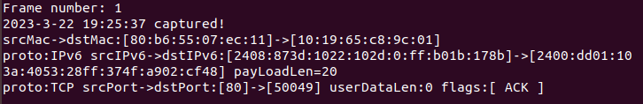
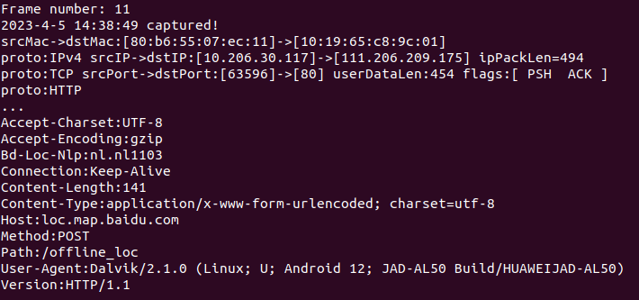

国科大《网络行为学导论》第一次作业，抓取pcap包并解析。

### 抓取pcap包

#### 百度网盘

查看百度网盘运行的pid:

查看相应进程网络连接状态：

在app中点击一些服务后再查看：

可以发现百度网盘提供分布式服务，记录这些IP，使用WireShark进行抓包并过滤：

#### 今日头条

手机下载今日头条APP，连接电脑端设置的热点，手机禁止其它应用使用WLAN：

电脑尽量关闭联网应用，手机打开今日头条浏览，使用WireShark抓包：

#### foodpanda

正确的步骤应为：本地主机连接到境外服务器，传输抓包命令，境外服务器抓取数据包后，再把数据包传回到本地主机。这种方法的缺点是需要拥有一台境外可用的服务器。

现在尝试使用本地主机通过境外服务器直接传输应用数据，在本地主机中抓取数据包，即通过一般翻墙服务实现。

华为手机下载foodpanda安卓版后闪退无法使用（已翻墙），故通过网页版抓取数据包。未翻墙状态下，foodpanda网页版功能受限，无法刷新页面详情：

使用赛风翻墙后快速恢复正常状态：

关闭其它联网应用后进行抓包：

不难发现，数据几乎都来自同一个IP地址并大多使用SSH服务：

使用这种方法得到的都是代理服务器包装过的foodpanda数据。

### 解析pcap数据包

#### 实现功能

1. 可解析pcap文件头，输出magic、版本字段；

2. 可解析每个Frame的数据包头，输出序号、抓包时间；

3. 数据链路层可输出源帧地址、目的帧地址和网络层协议（IPv4、ARP、RARP、IPv6、IPX/SPX、802.1x）；

4. 网络层可分别解析IPv4、IPv6协议，输出源IP地址、目的IP地址、IP包长和传输层协议（UDP、TCP）；

5. 传输层可分别解析UDP、TCP协议，输出源端口号、目的端口号、用户数据长度和应用层协议（HTTP、HTTPS、DNS）；

6. 应用层可解析HTTP、HTTPS协议。HTTP可输出除body外的所有字段。HTTPS可解析Record层协议，输出类型（Handshake、ChangeCipherSpec、Alert、ApplicationData）、版本和长度。

7. Handshake类型进一步解析，输出其类型（Hello-Request、Client-Hello、Server-Hello、Certificate、ServerKey-Exchange、ClientKey-Exchange、Finished）、版本和长度。

8. Client-Hello类型再进一步解析，输出Cipher-Suite、Server-Name。

#### 效果展示

##### 文件头：

##### 对照组1：

##### 对照组2：

##### 对照组3（HTTP请求，UA为华为手机）：

##### 对照组4（HTTP响应）：

##### 对照组5（以下为HTTPS）：

##### 对照组6：

##### 对照组7：

##### 对照组8（来自百度网盘）：

##### 对照组9（来自今日头条）：

### 总结

抓包过程需要熟练掌握各种应用工具，pcap包解析只要我们熟悉计算机网络的层次结构和各类协议的格式，就可以把数据包一层层剥开然后获取我们需要的信息。在代码编写过程中，尤其需要注重提升代码的鲁棒性，因此需要在代码中加入诸多判定条件。

### 参考链接：

【1】https://blog.csdn.net/fulianzhou/article/details/125186185

【2】https://github.com/yuesong-feng/httpParser

【3】https://github.com/kongxiangchx/Pcap-analyze

